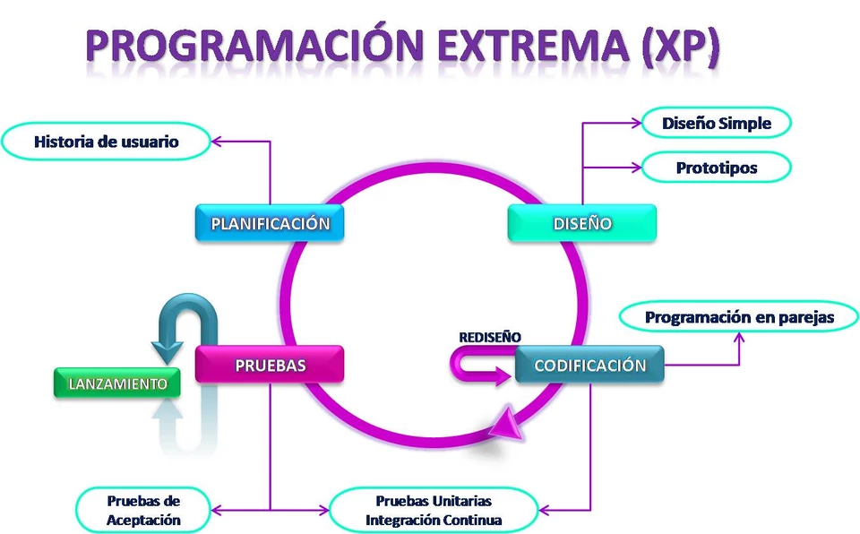
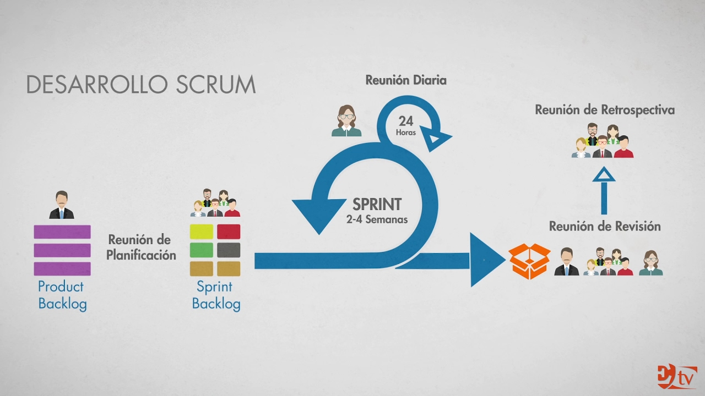
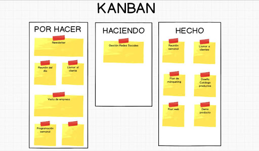
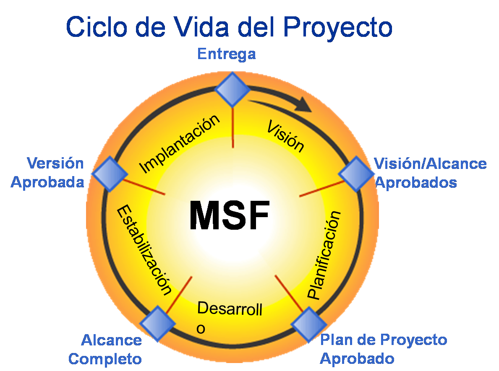
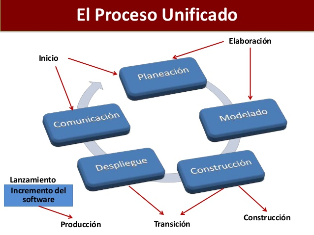
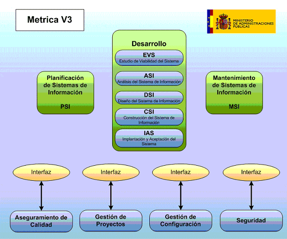

# METODOLOGIAS DEL DESARROLLO 

Las metodologías del desarrollo de software imponen un proceso disciplinado  sobre el desarrollo de software 
con el fin de hacerlo más predecible  y eficiente su principal objetivo  es aumentar la calidad del software
que se produce  en todas y  cada una de sus fases de  desarrollo. Construir un sistema informático eficiente,
que cumpla todos los requerimientos  planteados, es una  tarea  intensa y difícil de  cumplir. No existe una
metodología de software universal, ya que toda metodología  debe ser adaptada a las características  de cada
proyecto  (equipo de desarrollo, recursos, etc.)  exigiéndose  así  que   el  proceso sea  configurable. Las
metodologías de desarrollo se pueden dividir en dos grupos de acuerdo con sus características y los objetivos
que persiguen: ágiles y tradicionales.

### METODOLOGIAS AGILES 
Son caracterizadas por el contacto cara a cara con el cliente. donde cliente desarrollador y desarrollador 
mantienen una estrecha comunicación sobre el proyecto trabajando constantemente juntos. Estas metodologías 
están enfocadas en el resultado del producto y no tanto a la documentación, estas hacen el proceso adaptable
a cambios de ultimo momento. Los tipo de metodologías agiles son:

* #### Extreme Programming  (XP)
Es una metodología ágil centrada en potenciar las relaciones interpersonales como clave para el éxito en 
desarrollo de software, promoviendo el trabajo en equipo, preocupándose por el aprendizaje de los desarrolladores,
y propiciando un buen clima de trabajo. XP se basa en realimentación continua entre el cliente y el equipo de 
desarrollo, comunicación fluida entre todos los participantes, simplicidad en las soluciones implementadas y coraje 
para enfrentar los cambios.
XP se define como especialmente adecuada para proyectos con requisitos imprecisos y muy cambiantes, y donde existe un
alto riesgo técnico. Los principios y prácticas son de sentido común pero llevadas al extremo, de ahí proviene su nombre.

* #### Scrum
Se define un marco para la gestión de proyectos. Está especialmente indicada para proyectos con un rápido
cambio de requisitos. Sus principales características se pueden resumir en dos. El desarrollo de
software se realiza mediante iteraciones, denominadas sprints, con una duración de 30 días.
El resultado de cada sprint es un incremento ejecutable que se muestra al cliente. La segunda
característica importante son las reuniones a lo largo proyecto. Éstas son las verdaderas protagonistas,
especialmente la reunión diaria de 15 minutos del equipo de desarrollo para coordinación e integración.

Los principales beneficios que proporciona Scrum son:
1. Entrega mensual (o quincenal) de resultados (los requisitos más prioritarios en ese momento, ya completados) 
lo cual proporciona las siguientes ventajas:
2. Gestión regular de las expectativas del cliente y basada en resultados tangibles.
3. Resultados anticipados (time to market).
4. Flexibilidad y adaptación respecto a las necesidades del cliente, cambios en el mercado, etc.
5. Gestión sistemática del Retorno de Inversión (ROI).
6. Mitigación sistemática de los riesgos del proyecto.
7. Productividad y calidad.
8. Alineamiento entre el cliente y el equipo de desarrollo.
9. Equipo motivado.

* #### Kanban

Es un proceso minucioso de organización, recolección y administración de los datos requeridos para la elaboración de un sistema, utiliza tarjetas para gestionar, de manera visual, la realización de determinados procesos y tareas. Al ser un método visual permite que a simple vista se conozca el estado de los proyectos y asignar nuevas tareas de manera muy efectiva

* Ventajas de la metodología Kanban

1. Transparencia.
Los tiempos de entrega son más cortos y hay una mayor fiabilidad en los mismos. Todo el mundo sabe cuál es su tarea y en qué momento está de su ciclo.

2. Evita tareas ineficientes.
Se evita la sobreproducción y la limitación de los recursos, lo que supone una mayor disponibilidad de materiales.

3. Control de las tareas.
El tiempo de producción es más rápido, por tanto se reduce el control del esfuerzo y se mejora la planificación. Lo que afecta a la mayor productividad en el área de compras, abastecimiento y control. Aumenta la rotación de los inventarios y se necesita una menor capacidad de almacenamiento.

4. Flexibilidad.
Como todo el equipo sabe perfectamente cuál es su tarea y la realiza con eficacia, si surge alguna imprevista existe una capacidad de respuesta que permite atenderla.

* ### Las metodologías tradicionales
Se enfocan en llevar una documentación exhaustiva de todo el proceso de desarrollo y en cumplir con un plan de proyecto, definido en la fase inicial del mismo, a diferencia de las metodologías agiles en estas no trabajan en
conjunto el cliente desarrollador con el desarrollador del proyecto, su enfoque va más a la investigación y comprensión del trabajo realizado por el usuario  así como sus necesidades, para entregar todo de una y no por partes.

* #### Microsoft Solution Framework (MSF) 

Esta es una metodología flexible e interrelacionada con una serie de conceptos, modelos y prácticas de uso, que controlan la planificación, el desarrollo y la gestión de proyectos tecnológicos. MSF se centra en los modelos de proceso y de equipo dejando en un segundo plano las elecciones tecnológicas. Dentro de sus principales 

características se tiene que es:

- Adaptable: es parecido a un compás, usado en cualquier parte como un mapa, del cual su uso es limitado a un específico lugar.
- Escalable: puede organizar equipos tan pequeños entre 3 o 4 personas, así como también, proyectos que requieren 50 personas a más.
- Flexible: es utilizada en el ambiente de desarrollo de cualquier cliente.
- Tecnología Agnóstica: porque puede ser usada para desarrollar soluciones basadas sobre cualquier tecnología.

MSF se compone de varios modelos encargados de planificar las diferentes partes implicadas en el desarrollo de un proyecto: Modelo de Arquitectura del Proyecto, Modelo de Equipo, Modelo de Proceso, Modelo de Gestión del Riesgo, Modelo de Diseño de Proceso y finalmente el modelo de Aplicación. La Metodología MSF se adapta a proyectos de cualquier dimensión y de cualquier tecnología.

* #### Proceso unificado de desarrollo
El RUP no es un sistema con pasos firmemente establecidos, sino un conjunto de metodologías adaptables al contexto y necesidades de cada organización.
También se conoce por este nombre al software desarrollado por Rational, hoy propiedad de IBM, el cual incluye información entrelazada de diversos artefactos y descripciones de las diversas actividades. Está incluido en el Rational Method Composer (RMC), que permite la personalización de acuerdo a necesidades.
Originalmente se diseñó un proceso genérico y de dominio público, el Proceso Unificado, y una especificación más detallada, el Rational Unified Process, que se vendiera como producto independiente.

##### Principales elementos 

- Trabajadores (“quién”): Define el comportamiento y responsabilidades (rol) de un individuo, grupo de individuos, sistema automatizado o máquina, que trabajan en conjunto como un equipo. Ellos realizan las actividades y son propietarios de elementos.

- Actividades (“cómo”): Es una tarea que tiene un propósito claro, es realizada por un trabajador y manipula elementos. 

- Artefactos (“qué”): Productos tangibles del proyecto que son producidos, modificados y usados por las actividades. Pueden ser modelos, elementos dentro del modelo, código fuente y ejecutables.

- Flujo de actividades (“cuándo”): Secuencia de actividades realizadas por trabajadores y que produce un resultado de valor observable.

* #### SCRUM
El proceso en el que se aplican de manera regular un conjunto de buenas prácticas para trabajar colaborativamente, en equipo, y obtener el mejor resultado posible de un proyecto. Estas prácticas se apoyan unas a otras y su selección tiene origen en un estudio de la manera de trabajar de equipos altamente productivos.

En Scrum se realizan entregas parciales y regulares del producto final, priorizadas por el beneficio que aportan al receptor del proyecto. Por ello, Scrum está especialmente indicado para proyectos en entornos complejos, donde se necesita obtener resultados pronto, donde los requisitos son cambiantes o poco definidos, donde la innovación, la competitividad, la flexibilidad y la productividad son fundamentales.

* #### Métrica 3

Es una metodología de planificación, desarrollo y mantenimiento de sistemas de información. Ofrece a las Organizaciones un instrumento útil para la sistematización de las actividades que dan soporte al ciclo de vida del software dentro del marco que permite alcanzar sus objetivos como:

- Proporcionar o definir Sistemas de Información que ayuden a conseguir los fines de la Organización mediante la definición de un marco estratégico para el desarrollo de los mismos.

- Dotar a la Organización de productos software que satisfagan las necesidades de los usuarios dando una mayor importancia al análisis de requisitos.

- Mejorar la productividad de los departamentos de Sistemas y Tecnologías de la Información y las Comunicaciones, permitiendo una mayor capacidad de adaptación a los cambios y teniendo en cuenta la reutilización en la medida de lo posible.

- Facilitar la comunicación y entendimiento entre los distintos participantes en la producción de software a lo largo del ciclo de vida del proyecto, teniendo en cuenta su papel y responsabilidad, así como las necesidades de todos y cada uno de ellos.

- Facilitar la operación, mantenimiento y uso de los productos software obtenido.

By: Diana Laura Navarro Felix   
    Universidad Del Valle Del fuerte    
    Ingenieria en Sistemas Computacionales  
    Profe Max